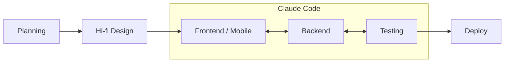

# dotclaude

My personal Claude Code configuration. A two-layer setup that makes Claude a reliable engineering partner across all my projects, not just a code generator.

## How it works

Configuration is split by scope. Rules that hold everywhere live at the global layer. Rules that only make sense inside one codebase live with that codebase.

```
dotclaude/
└── CLAUDE.md        ← global rules (applies everywhere)

your-project/
├── CLAUDE.md        ← project-level config
└── .claude/         ← per-project Claude setup
```

### Layer 1: Global (`CLAUDE.md`)

This repo. Defines how Claude should think and communicate regardless of project: mindset, code principles, communication style, safety guardrails, commit format, and tool preferences. It applies to every session across every codebase.

The four-point structure is adopted from Andrej Karpathy's CLAUDE.md, with my own conventions layered on top. The sections are deliberately ordered. Think before coding, then simplicity first, then surgical changes, then goal-driven execution. Each one constrains the next.

### Layer 2: Per-project

Lives in the project repo, not here. It layers in what the global rules cannot know: architecture overview, conventions, data layer patterns, env vars, and anything else specific to that codebase. Whatever Claude setup a project needs goes in its `.claude/` directory, scoped to that project alone.

## Workflow

How a feature actually moves from idea to production.



**Planning.** Finalize the PRD, break it into issues on the tracker, set up the initial project.

**Hi-fi design.** Turn the PRD into a high fidelity design before any code exists. Built with Claude Design and Stitch.

**Build.** Claude Code owns the implementation loop. Frontend, backend, and testing move together rather than in sequence, so a change on one side is reconciled against the others immediately. Testing covers both unit and E2E.

**Deploy.**

## Philosophy

The goal is not to make Claude do more. It is to make Claude predictable. A well-structured config means I can hand off a full feature and trust the output meets the same bar as a senior engineer review, without having to re-explain the architecture every session.

## Author

[Dharma Yudistira](https://dharma-yudistira.com), Fullstack and Flutter Engineer based in Sidoarjo, Indonesia.
